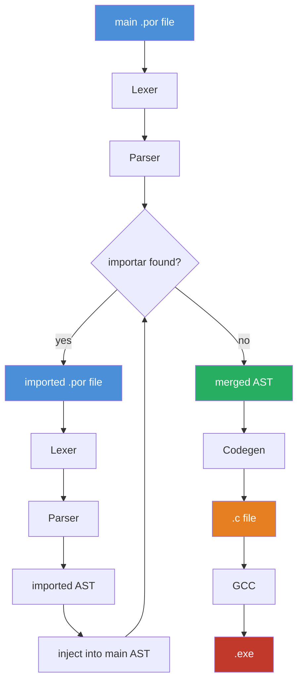

# Interpretador-Portugol

<p align="center">
  
  
  
  
</p>

<p align="center">
  Compilador de <strong>Portugol</strong> escrito em <strong>C</strong>, transpilando para C e compilando para um executável nativo.
  <br>
  Sintaxe baseada no <a href="https://github.com/dgadelha/Portugol-Webstudio">Portugol-Webstudio</a>.
</p>

---

## Pipeline



---

## Exemplo

```portugol
programa {
  importar "std/net.por"

  funcao inicio() {
    cadeia nome = "Maria Silva"
    inteiro idade = 28
    logico estudante = verdadeiro

    se (estudante e idade < 30) {
      escreva("jovem estudante")
    } senao {
      escreva("nao e estudante jovem")
    }

    para i = 0 ate 5 {
      escreva(i)
    }
  }
}
```

---

## Status

| Componente | Status |
|---|---|
| Lexer | Concluído |
| Parser | Em andamento |
| Preprocessor (`importar`) | Pendente |
| Codegen (transpile para C) | Pendente |
| Visitor | Pendente |
| Definição de funções | Em andamento |
| Chamada de funções | Pendente |
| Argumentos em funções | Em andamento |
| Leitura de arquivos | Concluído |
| Diagnósticos de erro | Concluído |

---

## Uso

```bash
# compilar o projeto
make

# rodar normalmente
./build/portugol arquivo.por

# rodar com debug (imprime a AST e logs internos)
./build/portugol -d arquivo.por
```

---

## Estrutura do Projeto

```
.
├── src/
│   ├── include/        # headers
│   ├── diagnostics/    # erros com linha e coluna
│   ├── debugger/       # logs de debug
│   ├── lexer.c
│   ├── parser.c
│   ├── AST.c
│   └── main.c
├── examples/           # arquivos .por de exemplo
├── Makefile
└── README.md
```

---

## Contribuições

Abra uma _issue_ ou envie um _pull request_. Qualquer contribuição é bem-vinda.

---

## Licença

[MIT](LICENSE) — Gabriel Vinícius da Maia.
