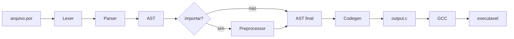

# Interpretador-Portugol

<p align="center">
  
  
  
  
</p>

<p align="center">
  Interpretador/compilador de <strong>Portugol</strong> escrito em <strong>C</strong>.
  <br>
  Atualmente realiza análise léxica e sintática, com geração de AST e base para transpilar para C.
  <br>
  Sintaxe inspirada no <a href="https://github.com/dgadelha/Portugol-Webstudio">Portugol-Webstudio</a>.
</p>

---

## Pipeline



## Pipeline detalhada

```mermaid
flowchart TD
    subgraph INPUT["Entrada"]
        A["arquivo .por"]
    end

    subgraph ORCH["Orquestrador — main.c"]
        M1["read_file\nlê o .por em memória"]
        M2["start_builtins\ninicia hash table"]
        M1 --> M2
    end

    subgraph LEX["Lexer — lexer.c"]
        direction TB
        L1["init_lexer\ncria contexto"]
        L2["lexer_get_next_token\nloop principal"]
        L3["lexer_collect_id\nidentificadores, números, keywords"]
        L4["lexer_collect_string\nstrings simples e interpoladas"]
        L5["interp_queue\nfila interna de tokens\nSTRING_PART + INTERP_EXPR"]
        L1 --> L2
        L2 --> L3
        L2 --> L4
        L4 --> L5
    end

    subgraph TOK["Tokens — token.h"]
        direction TB
        T1["TokenType enum\nTOKEN_ID TOKEN_SE\nTOKEN_MAIS TOKEN_MOD..."]
        T2["token_T\ntype + value\nline + column"]
        T1 --- T2
    end

    subgraph PAR["Parser — parser.c"]
        direction TB
        P1["parser_parse\nponto de entrada"]
        P2["parser_parse_programa\nparseia bloco programa {}"]
        P3["parser_parse_function_def\ntipo retorno + params"]
        P4["parser_parse_statements\nloop de statements"]
        P5["statement_rules[]\ntoken → função\nTABELA DE DESPACHO"]
        P6["Hierarquia de expressões\nexpr → comparison\n→ arith → term → factor"]
        P7["make_node\nstampa line + column\nno nó da AST"]
        P1 --> P2 --> P3 --> P4
        P4 --> P5
        P5 --> P6
        P6 --> P7
    end

    subgraph AST["AST — AST.h / AST.c"]
        direction TB
        AS1["AST_T\nstruct único com\ntodos os campos possíveis"]
        AS2["init_ast\naloca e zera"]
        AS3["ast_print\ndebug mode"]
        AS4["Nós disponíveis\nAST_PROGRAMA\nAST_FUNCTION_DEF\nAST_VARIABLE_DEFINITION\nAST_ASSIGN\nAST_VARIABLE\nAST_BINOP / AST_UNOP\nAST_SE / AST_ENQUANTO\nAST_PARA / AST_REPITA\nAST_RETORNE / AST_IMPORT\nAST_STRING / AST_STRING_INTERP\nAST_REAL / AST_BOOL\nAST_FUNCTION_CALL"]
        AS1 --> AS2
        AS1 --> AS3
        AS1 --- AS4
    end

    subgraph PRE["Preprocessor — preprocessor.c"]
        direction TB
        PR1["preprocessor_run\nvarre nós AST_IMPORT"]
        PR2["resolve_path\n'./' → local\nsem prefixo → libs/"]
        PR3["already_included\ndeduplicação por path"]
        PR4["lê + parseia\narquivo importado\ncria novo AST"]
        PR5["inject_nodes\nsubstitui AST_IMPORT\npelas funções importadas"]
        PR6["recursão\nimports dentro de imports"]
        PR1 --> PR2 --> PR3
        PR3 --> PR4 --> PR5 --> PR6
        PR6 --> PR1
    end

    subgraph SEM["Semântico — semantic.c"]
        direction TB
        SE1["semantic_check\nitera funções do programa"]
        SE2["check_node\nrecursão na AST"]
        SE3["scope_push/pop\npilha de escopos\nbloco { } novo escopo"]
        SE4["scope_declare\nregistra var + tipo"]
        SE5["scope_has\nverifica se var existe\nbusca da pilha pra cima"]
        SE6["make_fake_token\ncria token com line+col\ndo nó para diagnóstico"]
        SE1 --> SE2
        SE2 --> SE3
        SE2 --> SE4
        SE2 --> SE5
        SE5 --> SE6
    end

    subgraph CG["Codegen — codegen.c"]
        direction TB
        CG1["codegen_emit\ndespachador principal"]
        CG2["emit_rules[]\nAST type → emit_fn\nTABELA DE DESPACHO"]
        CG3["emit_expr\nexpressões recursivas\nBINOP UNOP VARIABLE..."]
        CG4["emit_programa\n#include headers\nforward declarations"]
        CG5["emit_function_def\ninicio() → main(void)"]
        CG6["emit_function_call\nescreva → printf\nleia → scanf"]
        CG7["emit_string_interp\nmonta format string\ncom tipos das variáveis"]
        CG8["codegen_register_var\ncodegen_lookup_type\ntabela nome → tipo"]
        CG9["resolve_builtin\nhash table\nportugol → C"]
        CG10["emit_se/enquanto\nemit_para/repita\nemit_retorne/assign"]
        CG1 --> CG2
        CG2 --> CG3
        CG2 --> CG4 --> CG5
        CG2 --> CG6 --> CG7
        CG6 --> CG9
        CG3 --> CG8
        CG2 --> CG10
    end

    subgraph OUT["Saída"]
        O1["build/output.c\nC gerado"]
        O2["GCC\ncodegen_compile"]
        O3["build/output\nexecutável nativo"]
        O4["system\nexecuta o binário"]
        O1 --> O2 --> O3 --> O4
    end

    subgraph DIAG["Diagnósticos — diagnostics.c"]
        direction TB
        DI1["diagnostic_error\ndiagnostic_warning\ndiagnostic_note\nmacros"]
        DI2["diagnostic_emit\nformata mensagem"]
        DI3["extract_line\npega linha do source"]
        DI4["saída ANSI colorida\narquivo:linha:coluna\nseta ^"]
        DI1 --> DI2 --> DI3 --> DI4
    end

    subgraph DBG["Debugger — debugger.c"]
        DB1["make_debugger\ncria instância com nome"]
        DB2["debugger_print\nsó imprime se debug=1\n[módulo] mensagem"]
        DB1 --> DB2
    end

    subgraph HELP["Helpers — operations.h"]
        H1["PANIC\nPANIC_IF\nerro fatal + exit"]
    end

    INPUT --> ORCH
    ORCH --> LEX
    LEX --> TOK
    TOK --> PAR
    PAR --> AST
    AST --> PRE
    PRE --> SEM
    SEM --> CG
    CG --> OUT

    LEX -.->|usa| DIAG
    PAR -.->|usa| DIAG
    SEM -.->|usa| DIAG
    LEX -.->|usa| DBG
    PAR -.->|usa| DBG
    PRE -.->|usa| DBG
    CG -.->|usa| DBG
    ORCH -.->|usa| HELP

    style INPUT fill:#1a3a5c,color:#fff
    style ORCH fill:#2d2d2d,color:#fff
    style LEX fill:#1a4a2e,color:#fff
    style TOK fill:#3d2b00,color:#fff
    style PAR fill:#3a1a4a,color:#fff
    style AST fill:#4a2020,color:#fff
    style PRE fill:#1a3a4a,color:#fff
    style SEM fill:#2a3a1a,color:#fff
    style CG fill:#4a3000,color:#fff
    style OUT fill:#c0392b,color:#fff
    style DIAG fill:#2d2d2d,color:#fff
    style DBG fill:#2d2d2d,color:#fff
    style HELP fill:#2d2d2d,color:#fff
```



---

## Exemplos

### Fibonacci

```portugol
programa {
  inteiro funcao fib(inteiro n) {
    se (n <= 1) {
      retorne n
    }
    retorne fib(n - 1) + fib(n - 2)
  }

  nulo funcao inicio() {
    escreva("${fib(10)}\n")
  }
}
```

### Fatorial

```portugol
programa {
  inteiro funcao fat(inteiro n) {
    se (n == 0) {
      retorne 1
    }
    retorne n * fat(n - 1)
  }

  nulo funcao inicio() {
    escreva("${fat(5)}\n")
  }
}
```

Arquivos disponíveis em `examples/`:

* `fibbonaci.por`
* `fatorial.por`

---

## Status

| Componente                | Status                        |
| ------------------------- | ----------------------------- |
| Lexer                     | Concluído                     |
| Parser                    | Em andamento                  |
| AST                       | Concluído (estrutura base)    |
| Preprocessor (`importar`) | Em desenvolvimento            |
| Codegen (C)               | Pendente                      |
| Execução direta           | Pendente                      |
| Funções (declaração)      | Em andamento                  |
| Funções (chamada)         | Parcial                       |
| Argumentos                | Em andamento                  |
| Recursão                  | Parcial (estrutura suportada) |
| Diagnósticos de erro      | Concluído                     |
| Debugger                  | Concluído                     |

---

## Uso

```bash
# compilar
make

# executar arquivo
./build/portugol examples/fibbonaci.por

# modo debug (AST + logs)
./build/portugol -d examples/fatorial.por
```

---

## Estrutura do Projeto

```
.
├── build/              # binários gerados
├── examples/           # exemplos em Portugol
├── libs/               # futuras bibliotecas padrão
├── src/
│   ├── include/        # headers
│   ├── diagnostics/    # erros e mensagens
│   ├── debugger/       # logs internos
│   ├── helpers/        # utilitários
│   ├── preprocessor/   # sistema de importação
│   ├── codegen/        # geração de C
│   ├── AST.c
│   ├── lexer.c
│   ├── parser.c
│   ├── token.c
│   └── main.c
├── Makefile
└── README.md
```

---

## Roadmap

* [ ] Finalizar parser
* [ ] Implementar `importar`
* [ ] Gerar código C completo
* [ ] Compilação automática com GCC
* [ ] Biblioteca padrão (`std`)
* [ ] Melhorar mensagens de erro
* [ ] Testes automatizados

---

## Contribuições

Sinta-se à vontade para abrir *issues* ou enviar *pull requests*.
Sugestões, melhorias e correções são bem-vindas.

---

## Licença

[MIT](LICENSE) — Gabriel Vinícius da Maia.

```
