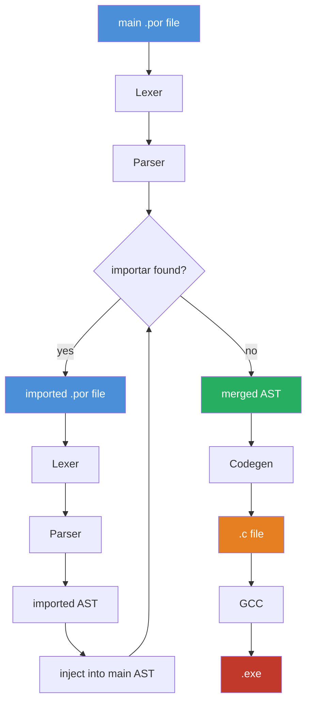

# Interpretador-Portugol

Interpretador de **Portugol** escrito em **C**, transpilando para C e compilando para um executável nativo. A sintaxe é baseada no [Portugol-Webstudio](https://github.com/dgadelha/Portugol-Webstudio).

> Projeto em desenvolvimento ativo. Feedbacks e contribuições são bem-vindos.

---

## Pipeline



---

## Exemplo
```
programa {
  funcao inicio() {
    cadeia nome = "Maria Silva"
    inteiro idade = 28
    logico estudante = verdadeiro
    se (estudante e idade < 30) {
      escreva("jovem estudante")
    } senao {
      escreva("nao e estudante jovem")
    }
  
    para i = 0 ate 5 {
      escreva(i)
    }
  }
}
```

---

## Status

| Componente | Status |
|---|---|
| Lexer | Concluído |
| Parser | Em andamento |
| Preprocessor (`importar`) | Pendente |
| Codegen (transpile para C) |  Pendente |
| Visitor |  Pendente |
| Definição de funções | Em andamento |
| Chamada de funções | Pendente |
| Argumentos em funções | Em andamento |
| Leitura de arquivos | Concluído |
| Diagnósticos de erro | Concluído |

---

## Uso

```bash
# rodar normalmente
./portugol arquivo.por

# rodar com debug (imprime a AST e logs de debug)
./portugol -d arquivo.por
```

---

## Contribuições

Abra uma _issue_ ou envie um _pull request_. Qualquer contribuição é bem-vinda.

---

## Licença

[MIT](LICENSE) — Gabriel Vinícius da Maia.
